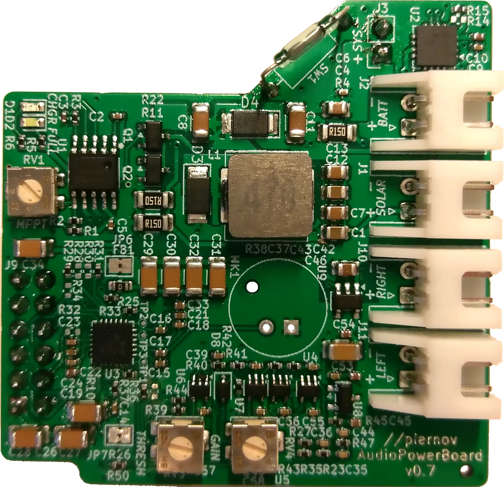
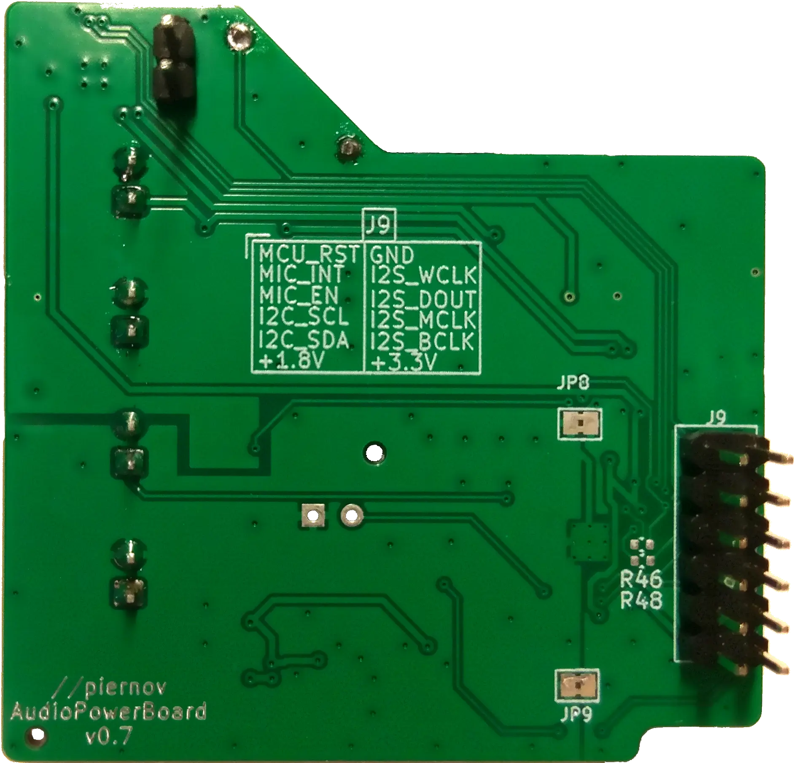

# Ambient audio capture and energy management daughterboard PCB

Audio capture and energy management daughterboard PCB for the [Ambient project](https://github.com/LEAT-EDGE/ambient).

    
    

## Main features

- Energy management:
  - Li-ion/LiPo charging circuit from photovoltaic cell with maximum power-point control (Consonance CN3791 controller),
  - solar and battery current and voltage monitoring (Texas Instrument INA3221 monitor),
- Audio capture:
  - analog-to-digital converter with microphone input amplification and digital filtering (Texas Instrument TLV320ADC3101),
  - analog audio wake-up circuit with high-pass filter and threshold detector.
- Magnetic reed switch for microcontroller reset

## Project structure
- `/` (repository root): KiCad project and libraries
- `pdf/`: Schematics generated from the KiCad project
- `png/`: Screenshots of the KiCad 3D render
- `production/`: Gerbers, BOM and placement files generated from the KiCad project (compatible with JLCPCB manufacturing and assembly)
- `webp/`: Pictures of the actual board

## Connectors and headers

### J1: SOLAR

Solar cell power input.

Solar cell voltage range: 4.6 V to 20 V.

| Pin   | Net      |
|-------|----------|
| **1** | `SOLAR+` |
| **2** | `GND`    |

### J2: BATTERY

Li-ion or LiPo single-cell battery.

Minimum charging current rating: 800 mA.

Cell with built-in protection circuit required.

| Pin   | Net     |
|-------|---------|
| **1** | `BATT+` |
| **2** | `GND`   |

### J3: SYS

Power output to the mainboard.

| Pin   | Net    |
|-------|--------|
| **1** | `SYS+` |
| **2** | `GND`  |

### J10: MIC_RIGHT

Unused in the Ambient variant.

Right condenser electret microphone input.

| Pin   | Net         |
|-------|-------------|
| **1** | `MIC_RIGHT` |
| **2** | `GNDA`      |

### J11: MIC_LEFT

Left condenser electret microphone input.

| Pin   | Net        |
|-------|------------|
| **1** | `MIC_LEFT` |
| **2** | `GNDA`     |

### J9

Connects to the [mainboard PCB](https://github.com/LEAT-EDGE/ambient-pcb-dkaiot).

Pinout:

| Pin    | Net            | Pin    | Net           |
|--------|----------------|--------|---------------|
| **12** | `MCU_RESET`    | **11** | `GND`         |
| **10** | `EXT_MIC_IO_2` | **9**  | `SAI_FS`      |
| **8**  | `EXT_MIC_IO_2` | **7**  | `SAI_SD`      |
| **6**  | `I2C2_SCL`     | **5**  | `SAI_MCLK`    |
| **4**  | `I2C2_SDA`     | **3**  | `SAI_SCK`     |
| **2**  | `VDD_1V8`      | **1**  | `V_PERIPH_3V` |

## Fabrication notes

### PCB

Standard 2-layer 1.6mm stackup:
- 2 layers (front/back),
- 1.6mm thickness (not mandatory),
- 1oz copper,
- FR-4 dielectric,
- HASL finish.

No special requirements, any solder mask and silkscreen color.

Gerbers, BOM and position files are provided in the `production/` directory but can be re-generated from the KiCad project using the Fabrication Toolkit plugin for JLCPCB.

### Assembly

Recommended automated assembly for top-side only.

Manual assembly for bottom side:
- J3 and J9 connectors (through-hole).

## Acknowledgment

This project has received funding from [Université Côte d'Azur](https://leat.univ-cotedazur.fr/) and [CERN](https://home.cern/).
